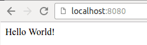
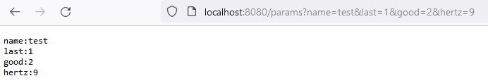
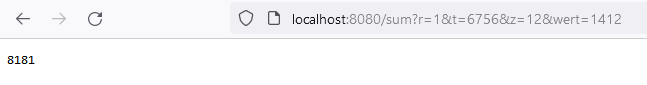

# Hello Web

The following code starts a http server, that listens on port 8080 and responds to all requests with "Hello World"

````go
// 01_A_hello_world
package main

import "net/http"

func main() {
	getHomeHandleFunc := func(w http.ResponseWriter, r *http.Request) {
		w.Write([]byte("Hello World"))
	}

	http.HandleFunc("/", getHomeHandleFunc)
	http.ListenAndServe(":8080", nil)
}
````

Note: You can shutdown the server using **ctrl+c**

A web application in Golang consists basically of three parts

* a Handler or Handlefunc
* a servemux
* a server

In our example we are using a single handlefunc, ``getHomeHandleFunc``.
We are using the default ServeMux and Server from the http package.
More on that later.

## Handlers and HandleFuncs

A Handler is what processes the HTTP request and writes the HTTP response.
In our example we are using a *HandleFunc*, that takes two arguments, a http.ResponseWriter and a pointer to a http.Request.
The only thing our HandleFunc does is convert the String "Hello World" to a byte slice and pass it to the Write method of the ResponseWriter

A handler is anything that implements the Handler interface, in other words, any type with a method ServeHTTP(ResponseWriter, *Request) is a handler

```go
type Handler interface {
    ServeHTTP(ResponseWriter, *Request)
}
```

Using a handler, our example would look like this:

````go
// 01_B_hello_world_handler
package main

import "net/http"

type myHandler {}

func (m *myHandler) ServeHttp(w ResponseWriter, r *Request){
	w.Write([]byte("Hello World"))
}

func main() {
	getHomeHandleFunc := func(w http.ResponseWriter, r *http.Request) {
		w.Write([]byte("Hello World"))
	}

	http.Handle("/", &myHandler{})
	http.ListenAndServe(":8080", nil)
}
`````

Having to create a new type for each Handler can quickly become rather cumbersome, thus there is some syntactic sugar in the form of ``http.HandleFunc``, which we have used in our example.
Unlike ``http.Handle``, it takes a function with signature (ResponseWriter, *Request).

HandleFunc does under the hood basically following:

In the net/http package, there is a function type HandlerFunc  with signature (http.ResponseWriter, *http.Request) and method ServeHTTP, which has the same signature as the function type.
Note the r, Handle**r**Func is a type. HandleFunc is a function
ServeHTTP calls the function it has been assigned to.
The function that is passed to HandleFunc is assigned to a variable of type HandlerFunc, which is also Handler, since HandlerFunc implements the ServeHTTP method.

You can find more information here: [https://www.willem.dev/articles/http-handler-func/](https://www.willem.dev/articles/http-handler-func/)

The process of turning a function to a handler is illustrated in the following example:

```go
// 01_C_hello_world_handleFunc
package main

import "net/http"

// we declare a function type
type myHandlerFunc func(http.ResponseWriter, *http.Request)

// we implement the ServeHTTP method on that type, thus making it a handler.
// ServeHTTP just calls the function it has been bound to.
func (g myHandleFunc) ServeHTTP(w http.ResponseWriter, r *http.Request){
	g(w, r)
}

// We create a variable of the function type, which again is also of type Handler
var getHome myHandlerFunc = func (w http.ResponseWriter, r *http.Request) {
	w.Write([]byte("Hello World"))
}

func main() {

  // We bind our handler (function) to a path
	http.Handle("/", getHome)
	http.ListenAndServe(":8080", nil)
}
```

Instead of bothering with a function type and its ServeHTTP method, we can pass our function to http.HandleFunc instead, which basically does the same.

## Servemux

aka router. A Servemux takes care of the mapping between URL paths and handlers.
In our example we are mapping the path "/" to the getHomeHandleFunc using the default Servemux from the http package by using the HandleFunc method, which takes a path string and a handler as its arguments.
This servemux is a global variable, thus it is possible that an imported package assigns routes to the default mux without you being aware of it. Hence it is usually a good idea to create your own ServeMux:

````go
//We create our own ServeMux by calling the NewServeMux function from the http package and 
//assign its return value to a variable, which is our new ServeMux, aptly named mux in our example.
mux := http.NewServeMux()

// We assign getHomeHandleFunc to the basic path "/" by calling the HandleFunc method of our ServeMux 
// and pass our mux as the second parameter to the server.
mux.HandleFunc("/", getHomeHandleFunc)
http.ListenAndServe(":8080", mux)
````

## Server

We are using the default server from the http package by calling ListenAndServe, which takes two arguments: The URL to listen for and a servemux.
We omitted the Host IP/domain, thus the server will listen on all available network interfaces.
*nil* was passed as the servemux. In this case the default server defaults to the default servemux. If you are using a custom ServeMux, you can pass that instead.

## Testing

We can write our tests in a file whose name has to have the suffix ``_test``.
``myTest.go`` is invalid, whereas ``xyz_test.go`` is valid.

```go
package main

// The packages ``testing`` and ``net/http/httptest`` are needed for our tests.
import (
	"testing"
	"net/http"
	"net/http/httptest"
)

// We define our unit test with a function, whose name starts with Test (note the uppercase T) and which receives a pointer to a testing.T object.
func TestGETHelloWorld(t *testing.T) {

// In the function, we run subtests using the Run method of ``t``.
// The Run method takes a string for the name of the subtest, as well as a function with parameter *testing.T to run the subtest.
	t.Run("GET", func(t *testing.T) {
		// We create a GET request pointer ``request, _ := http.NewRequest(http.MethodGet, "/", nil)``
		request, _ := http.NewRequest(http.MethodGet, "/", nil)

		// We create a dumme responsewriter ``response := httptest.NewRecorder()``
		response := httptest.NewRecorder()

		// We call our HandleFunct using our responsewriter and request pointer.
		getHomeHandleFunc(response, request)

		// We assign the response body to a variable
		got := response.Body.String()

		// We assign the expected output to a variable
		want := "Hello World"

		// We compare the returned response to the expected value. If those don't match, we call the Errrof method of ``t`` with an error message
		if got != want {
			t.Errorf("got %q, want %q", got, want)
		}
	})
}
```

---

## Exercise 01: Hello Golang!

---

Recreate the hello world example.
Extend the "hello world" program, the server should respond with "Correct!" to requests to path ``/correct``

* [ ] There are tests for your code
* [ ] Don't use the default Servemux, create your own
* [ ] Your server listens on port 8080
* [ ] Your server responds with "Hello World!" to requests.
  
* [ ] Your server responds with "Correct!" to requests to /correct.

Note: How does your server respond to requests at path ``/hello`` ?

Hint: You need to create a new handleFunc and bind it to the path "/correct" in your ServeMux
---------------------------------------------------------------------------------------------

---

## Fixed path vs Subtreepaths

Golang net/http support two kinds of path patterns, fixed path and subtree paths.
Subtree paths are those that end with ``/`` eg ``/fixed/`` or just ``/``. If it doesn't end with a /, it is a fixed path.

Fixed paths have to match exactly, whereas subtree paths are treated as if they had a wildcard appended.
Subtree paths also uses longest path matching.

Let us illustrate this with some examples:

```go
mux.HandleFunc("/", handleFunc1)
mux.HandleFunc("/files/", handleFiles)
mux.HandleFunc("/files/list", listFiles)
```

A request to ``/`` will execute handleFunc1.
A request to ``/hello`` would also execute handleFunc1, since ``/`` is the longest matching subtree path.
A request to ``/files/movies`` or ``/files/books`` would both execute handleFiles, since longest matching bound path is ``/files``
A request to ``/files/list`` would execute listFiles, since it is the longest matching path and matches exactly, whereas a request ``/files/list/`` would execute handleFiles, because it is a subtree path and the longest matching path is ``/files/``

That is alsow why a request to ``/hello`` to ``/`` in the exercise above returns "Hello World!". The longest matching subtree path is ``/``

## Request parameters

Information can be sent to the server as request parameters. Let's first familiarize ourselves with the way in which the request parameters are added to the address. For example, in a request ``http://localhost:8080/salaisuus?onko=naurisis`` a parameter called onko, whose value is defined as the value naurisis.
Adding parameters to the request is done by adding a question mark after the address, followed by the name of the parameter, an equal sign and the value to be given to the parameter.

The parameters in the request can be accessed using http.Request pointer ``r`` by ``r.URL.Query().Get(PARAM_NAME_AS_STRING)``. By default, the request parameter is returned as a string. You can get all request parameters, with just ``r.Url.Query()`` , which returns the parameters as a map with string keys and string array values (``map[string][]string``), where the keys are the names of the request parameters.

The application in the example below greets all requesters. The program handles the path ``/hello`` requests and returns a greeting in response. The following is added to the greeting in the request name-parameter value. You can pass multiple request parameters by concatinating them with ``&`` eg ``/hello?name=alice&age=55`` will pass the parameters ``name`` and ``age`` to the server.

```go
package main

import (
	"net/http"
	"fmt"
)

func getHelloHandleFunc(w http.ResponseWriter, r *http.Request) {
	fmt.Fprintf(w, "Hello %s", r.URL.Query().Get("name"))
}

func main() {
	mux := http.NewServeMux()
	mux.HandleFunc("/hello", getHelloHandleFunc)
	http.ListenAndServe(":8080", mux)
}
```

---

## Exercise 02: Request Parameters

---

Extend the "hello world" program, the server should respond with "hello" + a name passed as a request parameter to path ``/hello``.
If no parameter is given, return "Hello World!"

Additionally, add a new path ``/params``. A GET request to ``/params`` should return all the request parameters and their values.
This should work with an arbitrary number of parameters.

Add a path ``sum``. A GET request to ``/sum`` should return the sum of all the request parameters, assume that they are all representation of numeric values.
This should work with an arbitrary number of parameters. Keep in mind that request parameters are passed as Strings.

* [ ] There are tests for your code
* [ ] GET ``/hello`` returns "Hello World!"
* [ ] GET ``/hello?name=Alice`` returns "Hello Alice!"
* [ ] GET ``/params`` returns all request parameters and their values in a reasonably well formatted form, eg
* [ ] GET ``/params`` returns the sum of all request parameters, eg
  

---

---
